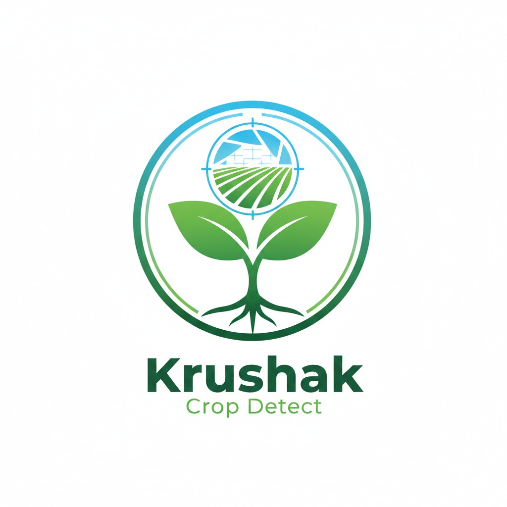

# Krushak

<p align="center">
	
</p>

<p align="center">
	<b>Offline AI Farm Autopilot for Bharat</b><br/>
	Built for HackSphere League 2026 under the AgriNext Bharat theme
</p>

<p align="center">
	
	
	
	
</p>

## Problem Statement

Indian farmers, especially small and marginal farmers, often take high-impact farm decisions (irrigation, pest control, selling) using delayed or incomplete information. In low-connectivity areas, this causes:

- Crop loss due to late disease and pest response
- Water wastage from sub-optimal irrigation timing
- Income loss from weak market timing
- Limited access to daily actionable guidance in local languages

Krushak addresses this with an offline-first AI assistant that turns complex farm data into simple daily decisions.

## What Krushak Is

Krushak is an AI-powered agriculture assistant focused on practical, on-ground utility:

- Detect plant diseases from images
- Provide treatment guidance and remedies
- Assist farmers through voice-based interactions
- Offer local agri news, reminders, and market support
- Work with unreliable internet through offline-first design patterns

## Feature Set for Hackathon Evaluation

### 1) Core Prototype Features (Implemented in this repository)

- Plant disease detection using on-device TensorFlow Lite model assets
- Camera and gallery scan support
- Scan result with confidence and remedy guidance
- Agri advisory chat assistant
- Voice input (speech-to-text) for farmer queries
- Voice output (text-to-speech) for accessibility and ease of use
- Agri news feed with location context
- Marketplace screen for crop/mandi price information
- Reminder system for farm tasks
- Localized language support with multilingual resource files

### 2) Full Hackathon Vision Features (from CtrlAltElite_Krushak.pdf)

- **Daily AI Instructions (Today Plan):** Personalized actions like irrigation timing, delay/advance sale, crop care checklist
- **Predictive Risk Meter:** Early risk indicators for weather stress, pest outbreaks, and water stress
- **Profit Optimizer:** Recommends better selling windows and potential income difference
- **Village AI Network (Offline):** Farmer-to-farmer alert sharing via Bluetooth/Wi-Fi Direct
- **Voice Command + Multilingual Support:** Natural query flow such as "What should I do today?" in regional languages
- **Offline AI Advisory:** On-device/local edge inference for low-connectivity operation
- **Offline Data Caching:** Local storage of crop history, advisories, notes, and queued actions
- **Store-and-Sync Model:** Background sync and delta upload when internet becomes available
- **Knowledge Pack Updates:** Pull updated advisories and model packs once connected

### 3) Offline Integration Blueprint

- **On-device/Edge models:** Lightweight mobile models for disease/advisory workflows
- **Local storage:** SQLite/shared local persistence for user and farm context
- **Offline communication:** Bluetooth/LAN-style sharing for village-level awareness
- **Resilient sync:** Pending events model with auto-resume when network returns

## System Workflow

1. Farmer captures crop image or asks a voice/text question
2. Krushak runs local-first analysis/advisory logic
3. App returns clear, actionable recommendation
4. Data and actions are cached locally
5. If internet is available, app syncs updates and fetches fresh knowledge/model updates

## Technology Stack

### App and UI

- Flutter (Material 3)
- Dart

### AI and Inference

- TensorFlow Lite (`tflite_flutter`)
- Image preprocessing (`image` package)

### Device and Platform Capabilities

- Camera (`camera`)
- Gallery (`image_picker`)
- Speech-to-text (`speech_to_text`)
- Text-to-speech (`flutter_tts`)
- Geolocation (`geolocator`, `geocoding`)
- Local persistence (`shared_preferences`)

### Data and Integrations

- HTTP-based API integrations for advisory/news workflows

## Repository Structure

- `lib/main.dart`: Main application, screens, navigation, chat, scan, reminders, marketplace
- `assets/model.tflite`: Bundled model asset for inference
- `assets/class_indices.json`: Class index mapping
- `assets/remedies.json`: Local remedy mapping
- `assets/i18n/`: In-app translation content
- `models/`, `other_model/`: Additional model artifacts used during experimentation

## Setup and Run

### Prerequisites

- Flutter SDK (3.x recommended)
- Android Studio / Android SDK
- Physical Android device or emulator

### Install dependencies

```bash
flutter pub get
```

### Run

```bash
flutter run
```

### Build APK

```bash
flutter build apk
```

## Demo Value for Judges

- Solves a real rural connectivity pain-point with offline-first approach
- Converts data into daily decisions instead of only showing static information
- Combines disease detection, advisory assistant, voice, market awareness, and reminders in one workflow
- Designed for scalability to multiple crops, regions, and languages

## Impact Goals

- Reduce avoidable crop loss
- Improve irrigation efficiency and resource usage
- Increase farmer income through better market decision support
- Improve digital accessibility for non-technical and regional-language users

## Team CtrlAltElite

- Team Leader: Slora Bar (Computer Engineering, Year II)
- Team Member: Vanessa Rodrigues (Computer Engineering, Year III)
- Team Member: Sai Balkawade (Computer Engineering, Year II)

## Security and Configuration Notes

- API keys are currently present in source constants for development convenience.
- Before production/demo distribution, move credentials to secure config and rotate keys.

## Contributing

Please refer to [CONTRIBUTING.md](CONTRIBUTING.md) and [CODE_OF_CONDUCT.md](CODE_OF_CONDUCT.md).
